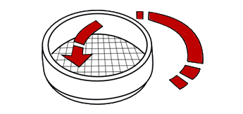
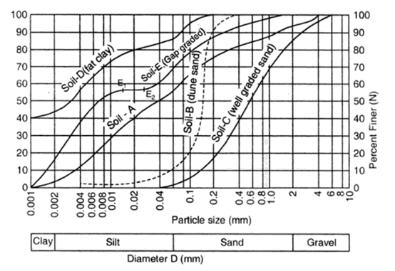

### INTRODUCTION 

### Fineness Modulus of Cement :

Cements exhibit different properties and characteristics depending upon their chemical compositions. By changing the fineness of grinding or the oxide composition, cement can be made to exhibit different properties. The fineness modulus of cement has an important bearing on the rate of hydration and hence on the rate of gain of strength and also on the rate of evolution of heat. Finer cement offers a greater surface area for hydration and hence faster the development of strength. Different cements are ground to different fineness. The fineness modulus of cement is measured by sieving it through a standard sieve. The disadvantage of fine grinding is that it is susceptible to air-set and early deterioration. Maximum number of particles in a sample of cement should have a size less than about 100 microns. The smallest particle may have a size of about 1.5 microns. By and large an average size of the cement particles may be taken as about 10 micron. The particle size fraction below 3 microns has been found to have the predominant effect on the strength at one day while 3-25 micron fraction has a major influence on the 28 days strength. Increase in fineness modulus of cement is also found to increase the drying shrinkage of concrete. In commercial cement it is suggested that there should be about 25-30 percent of particles of less than 7 micron in size.

The fineness modulus  of cement is a standard measure of the size of cement particles and is expressed in terms of the specific surface area of cement. The Fineness Modulus Test of Cement is done by sieving cement samples through standard IS sieve (90µm IS Sieve). The weight of cement particles whose size is greater than 90 microns is determined and the percentage of retained cement particles are calculated. This is known as the Fineness Modulus of Cement.

The proportion of cement grain larger than the specified mesh size is determined by sieve analysis. i.e., the percentage weight retained on the sieve.

 

Precautions to be taken while performing sieve analysis:

1. The cement sample should not have any air lumps.

2. Sieve should be done by rotating the sieve not by translation.

### Fineness Modulus of Fine Aggregates :

Fine aggregates is the sand used in mortars. The size of the fine aggregate is limited to maximum 4.75mm beyond which it is known as coarse aggregates. Fineness modulus is only a numerical index of fineness that gives some idea about the mean size of the articles in the entire body of concrete. Determination of fineness modulus is considered as a method of standardization of grading of aggregate i.e. the main object of finding fineness modulus is to grade the given aggregate for the most economical mix and workability with minimum quantity of the cement. It is obtained by sieving the known weight of given aggregate in a set of standard sieves and by adding the weight percent of material retained on all the sieves and dividing the total percentage by 100.

There are different methods for carrying out sieve analyses, depending on the material to be measured.

#### 1. Throw-action :

Here a throwing motion acts on the sample. The vertical throwing motion is overlaid with a slight circular motion which results in distribution of the sample amount over the whole sieving surface. The particles are accelerated in the vertical direction (are thrown upwards). In the air they carry out free rotations and interact with the openings in the mesh of the sieve when they fall back. If the particles are smaller than the openings, they pass through the sieve. If they are larger, they are thrown upwards again. The rotating motion while suspended increases the probability that the particles present a different orientation to the mesh when they fall back again, and thus might eventually pass through the mesh.

</img>

#### 2. Horizontal :

In a horizontal sieve shaker the sieve stack moves in horizontal circles in a plane. Horizontal sieve shakers are preferably used for needle-shaped, flat, long or fibrous samples, as their horizontal orientation means that only a few disoriented particles enter the mesh and the sieve is not blocked so quickly.

</img>

#### 3. Tapping :

A horizontal circular motion overlies a vertical motion which is created by a tapping impulse. These motional processes are characteristic of hand sieving and produce a higher degree of sieving for denser particles (e.g. abrasives) than throw-action sieve shakers.

The grading of the sample can be determined by producing a grading curve and critical particle sizes D60, D30 and D10 that correspond to 60, 30 and 10 % passing should be marked on the curve to get the values of the coefficients of uniformity (Cu) and curvature(Cc) and finally by comparing these values to critical ranges whether the material is well graded or poorly graded can be obtained.

The grading characteristics are then determined as follows:

1. Effective size = D10

2. Uniformity coefficient,

3. Curvature coefficient,

Where,

D60= size at 60% finer by weight

D30= size at 30% finer by weight

D10= size at 10% finer by weight

|              |          |   Symbol               |          Group Name         |
|:-----------------------------------:|:----------------------------:|:-----:|:----------------------------:|
|    Clean Sands-less than 5% fines   |         Cu≥6 & 1≤Cc≤3        |   SW  |       Well-graded sand       |
|                                     |       Cu<6 &/or 1>Cc>3       |   SP  |      Poorly-graded sand      |
| Sand with fines-5 to 12% clay fines |         Cu≥6 & 1≤Cc≤3        | SW-SC |  Well-graded sand with clay  |
|                                     |       Cu<6 &/or 1>Cc>3       | SP-SC | Poorly-graded sand with clay |
| Sand with fines-5 to 12% silt fines |         Cu≥6 & 1≤Cc≤3        | SW-SM |  Well-graded sand with silt  |
|                                     |       Cu<6 &/or 1>Cc>3       | SP-SM | Poorly-graded sand with silt |
|    Sand with more than 12% fines    | Fines classified as CL or CH |   SC  |          Clayey sand         |
|                                     | Fines classified as ML or MH |   SM  |          Silty sand          |

If sand contains >=15% gravel, add "with gravel" after group name. If fines are organic, add "with organic fines" after group name.

</img>

### Fineness Modulus of Coarse Aggregates :

The sieve analysis, commonly known as the gradation test. It determines the gradation (the distribution of aggregate particles, by size, within a given sample) in order to determine compliance with design, production control requirements, and verification specifications. The gradation data may be used to calculate relationships between various aggregate or aggregate blends, to check compliance with such blends, and to predict trends during production by plotting gradation curves graphically.

There are different methods for carrying out sieve analyses, depending on the material to be measured.

#### 1. Throw-action :

Here a throwing motion acts on the sample. The vertical throwing motion is overlaid with a slight circular motion which results in distribution of the sample amount over the whole sieving surface. The particles are accelerated in the vertical direction (are thrown upwards). In the air they carry out free rotations and interact with the openings in the mesh of the sieve when they fall back. If the particles are smaller than the openings, they pass through the sieve. If they are larger, they are thrown upwards again. The rotating motion while suspended increases the probability that the particles present a different orientation to the mesh when they fall back again, and thus might eventually pass through the mesh.

</img>

#### 2. Horizontal :

In a horizontal sieve shaker the sieve stack moves in horizontal circles in a plane. Horizontal sieve shakers are preferably used for needle-shaped, flat, long or fibrous samples, as their horizontal orientation means that only a few disoriented particles enter the mesh and the sieve is not blocked so quickly. 

</img>

#### 3. Tapping :

A horizontal circular motion overlies a vertical motion which is created by a tapping impulse. These motional processes are characteristic of hand sieving and produce a higher degree of sieving for denser particles (e.g. abrasives) than throw-action sieve shakers.

#### Types of gradation :

#### 1. Dense gradation :

A dense gradation refers to a sample that is approximately of equal amounts of various sizes of aggregate. By having a dense gradation, most of the air voids between the material are filled with particles. A dense gradation will result in an even curve on the gradation graph.

#### 2. Narrow gradation :

Also known as uniform gradation, a narrow gradation is a sample that has aggregate of approximately the same size. The curve on the gradation graph is very steep, and occupies a small range of the aggregate. 

#### 3. Gap gradation :

A gap gradation refers to a sample with very little aggregate in the medium size range. This results in only coarse and fine aggregate. The curve is horizontal in the medium size range on the gradation graph. 

#### 4. Open gradation :

An open gradation refers an aggregate sample with very little fine aggregate particles. This results in many air voids, because there are no fine particles to fill them. On the gradation graph, it appears as a curve that is horizontal in the small size range. The Unified Soil Classification system also designates coarse-grained samples that have 12% or fewer fines as being either well graded or poorly graded. This is determined by producing a grading curve for the sample, determining the values of the critical particle sizes D60, D30 and D10 that correspond to 60, 30 and 10 % passing, calculating the values of the coefficients of uniformity, Cu and curvature, Cc and finally comparing these values to critical ranges to determine whether the material is well graded or poorly graded. 

To obtain the grading characteristics, three points are located first on the grading curve.
The grading characteristics are then determined as follows:

1. Effective size = D10

2. Uniformity coefficient,

3. Curvature coefficient,

Where,

D60= size at 60% finer by weight

D30= size at 30% finer by weight

D10= size at 10% finer by weight

|                 |  |Symbol                |          Group Name                                               |
|:-------------------------------------:|:----------------------------:|:-----:|:------------------------------:|
|    Clean gravel-less than 5% fines    |         Cu≥4 & 1≤Cc≤3        |   GW  |       Well-graded gravel       |
|                                       |       Cu<4 &/or 1>Cc>3       |   GP  |      Poorly-graded gravel      |
| Gravel with fines-5 to 12% clay fines |         Cu≥4 & 1≤Cc≤3        | GW-GC |  Well-graded gravel with clay  |
|                                       |       Cu<4 &/or 1>Cc>3       | GP-GC | Poorly-graded gravel with clay |
| Gravel with fines-5 to 12% silt fines |         Cu≥4 & 1≤Cc≤3        | GW-GM |  Well-graded gravel with silt  |
|                                       |       Cu<4 &/or 1>Cc>3       | GP-GM | Poorly-graded gravel with silt |
|    Gravel with more than 12% fines    | Fines classified as CL or CH |   GC  |          Clayey gravel         |
|                                       | Fines classified as ML or MH |   GM  |          Silty gravel          |

If gravel contains ≥15% sand, add “with sand” after group name. If fines are organic, add “with organic fines” after the group name.

</img>

#### Relevant Indian Standard for Fineness Modulus Test :
1. IS 2386-1 (1963): Methods of Test for Aggregates for Concrete, Part I: Particle Size and Shape.
 
